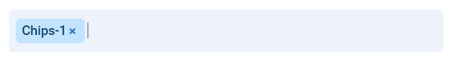

# Компонент "Chips"

Загрузите проект. После запустите его с помощью команды npm start

## Что включает в себя Компонент "Chips"?

Данный компонент состоит из input поля и chips компонента:

## Как работает Компонент "Chips"?
1. В инпут поле можно ввести имя чипса и нажать на клавишу , (запятая) на клавиатуре. После создается чипс с веденным значением.
2. В процессе набора текста можно напечатать знак ” (кавычка). Запятые, обернутые в кавычки, не создают новый чипс.
3. Если закрыть кавычку и нажать на запятую, чипс создастся.
4. Если выйти из режима редактирования текста (событие blur) с набранным текстом в инпут поле, то создается чипс с данным текстом.
5. Текст чипса можно редактировать при нажатии на него.
6. При редактировании чипса можно нажать на клавишу , (запятая). После выхода из редактирования (событие blur), чипс делится на несколько с запятым в качестве разделителя.
7. При клике на крестик можно удалить любой чипс.
8. Нажав на клавишу "Backspace" можно удалить последний чипс.
